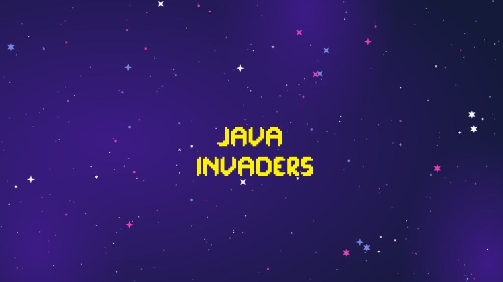
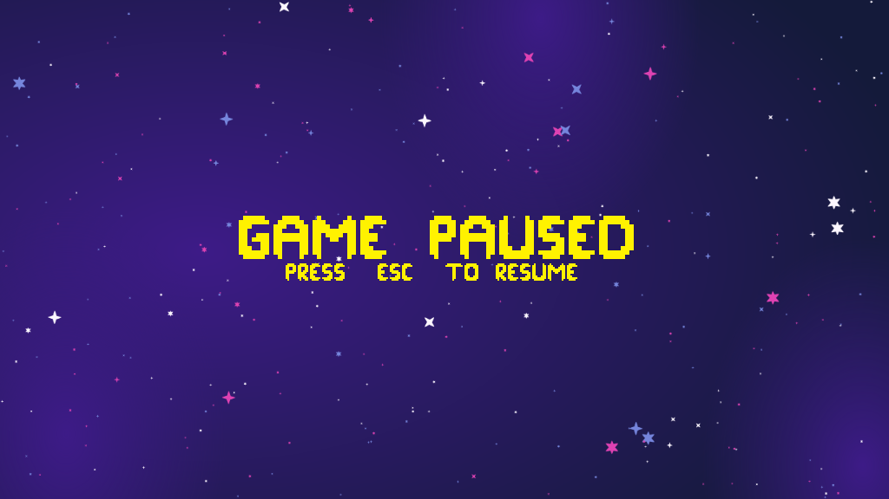
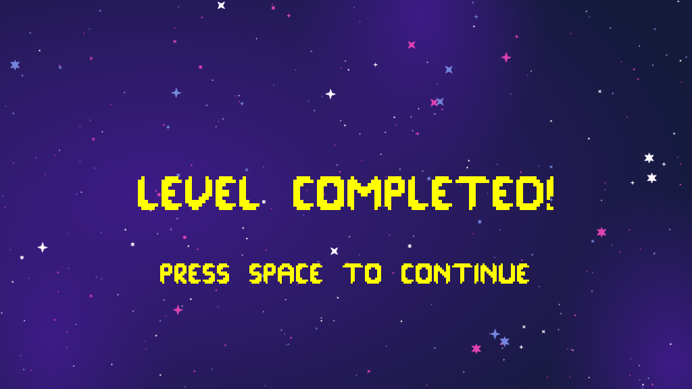

# Java Invaders 🚀👾

> Um clone clássico do arcade Space Invaders com arquitetura modular, desenvolvido em Java.


## 📋 Descrição

Este projeto consiste no desenvolvimento de um jogo *Shoot 'em up* 2D inspirado no clássico Space Invaders. O jogo foi construído aplicando princípios avançados de **Programação Orientada a Objetos (POO)** e estruturação de dados, utilizando o motor gráfico **LibGDX**. 

O jogador controla uma nave de combate na parte inferior da tela e deve destruir uma frota alienígena invasora antes que eles alcancem o solo ou destruam a nave com suas bombas.

---

## 🚀 Funcionalidades Técnicas

A arquitetura do código foi projetada para garantir performance e fácil manutenção, implementando:

* **Design Pattern de Subsistemas (Managers):** Entidades agrupadas sob a tutela de gerenciadores dedicados (`BombManager`, `LaserManager`, `AlienFleet`, etc.), garantindo um baixo acoplamento e evitando sobrecarga na classe principal da tela.
* **Progressão de Níveis Algorítmica:** O jogo possui 3 estágios. A cada novo nível alcançado, a matriz de inimigos cresce de tamanho, a velocidade de movimentação em blocos acelera e o intervalo de ataques (`ALIEN_SHOOT_INTERVAL`) fica mais agressivo.
* **Otimização de Renderização (VRAM):** Texturas e *SpriteSheets* são carregados uma única vez na memória pelos Managers. As entidades individuais apenas recebem o quadro atual da animação (`TextureRegion`) emprestado no momento do desenho, mantendo o FPS alto.
* **Máquina de Estados de Tela (Screen Lifecycle):** Transições de menu perfeitamente isoladas. O sistema conta com Injeção de Dependência para a funcionalidade de *Pause*, permitindo congelar o renderizador da fase sem destruir a tela na memória.
* **Hitbox e Game Feel:** Separação matemática entre a caixa de renderização visual (sprite) e a caixa de colisão de dano (*Collision Box*), usando o método *Axis-Aligned Bounding Box* (AABB) do LibGDX para garantir colisões precisas e justas.

---

## 🎮 Como Jogar

### Objetivo
Sobreviva aos 3 níveis de dificuldade destruindo todos os alienígenas na tela. Desvie das bombas vermelhas que caem da frota. Você possui 3 vidas no total para completar o desafio.

### Controles Básicos

| Tecla | Ação |
| :---: | :--- |
| **A** ou **<-** | Mover nave para a Esquerda |
| **D** ou **->** | Mover nave para a Direita |
| **Espaço** | Disparar Laser |
| **ESC** | Pausar Jogo |

### Elementos do Jogo

| Entidade | Descrição |
| :--- | :--- |
| **Nave do Jogador** | Protagonista. Movimenta-se no eixo X e dispara contra a frota inimiga. |
| **Alien** | Inimigo que se move em blocos sincronizados. Ganha velocidade ao tocar os limites da tela. |
| **Bomba** | Projétil inimigo. Custa 1 vida ao jogador se colidir. |
| **Laser** | Projétil do jogador. Concede pontos ao destruir Aliens, proporcionalmente às vidas do player. |

---

## 💻 Como Executar

Este projeto utiliza o [Gradle](https://gradle.org/) para o gerenciamento de dependências. O *Gradle wrapper* já está incluso no repositório, permitindo compilar o jogo sem precisar instalar o Gradle globalmente na máquina.

1.  **Baixe o Repositório:**
    ```bash
    git clone [https://github.com/JoaoMarcelo-Faria/](https://github.com/JoaoMarcelo-Faria/)[NOME-DO-REPO].git
    ```

2.  **Rodando via IDE (IntelliJ / Eclipse):**
    * Importe o projeto apontando para o arquivo `build.gradle` na raiz.
    * Aguarde a sincronização das dependências.
    * Encontre o arquivo `DesktopLauncher.java` no módulo `lwjgl3` (ou `desktop`) e execute-o.

3.  **Rodando via Terminal (Gradle Wrapper):**
    Abra o terminal na pasta raiz do projeto e utilize os comandos nativos:
    
    * Para **iniciar** o jogo diretamente:
      ```bash
      ./gradlew lwjgl3:run
      ```
    * Para **compilar** a versão final distribuível (.jar):
      ```bash
      ./gradlew lwjgl3:jar
      ```
      *(O executável será gerado dentro da pasta `lwjgl3/build/libs`)*.

### Comandos Úteis do Gradle
* `./gradlew clean`: Remove as pastas `build` com as classes compiladas antigas.
* `./gradlew --refresh-dependencies`: Força a validação e atualização de todas as bibliotecas do LibGDX.
---

## 📸 Screenshots

| Menu Principal |
| :---: |
|  |

| Tela de Pause|
| :---: |
|  |

| Troca de níveis |
| :---: |
|  |


---

## ✒️ Autores

* **João Marcelo Geraldo Cintra Faria** - [GitHub](https://github.com/JoaoMarcelo-Faria)
* **Murilo Ortega Pereira** - [GitHub](https://github.com/muorts)
* **Pedro Rondi** - [GitHub](https://github.com/PedroRondi)

---
